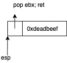
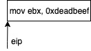

# Return-Oriented Programing

ROPは戻り先が関数ではなく, 最後にリターン命令が存在する一塊りの命令セットを利用した攻撃テクニックである.
ROPに使用可能な命令セットは, **ガジェット(gadget)**と呼ばれる.
gadgetは, ロード(load), 加算(add), ジャンプ(jump)などのよく知られた操作を行う.

ROPは意図した位相差を行うgadgetを組み合わせることで実現される.

gadgetは, gadgetのアドレスを参照するスタックポインタ(esp(rsp))を用意し, リターン命令を呼び出すことによって実行される.

例えば次の命令をみる
```
pop ebx;
ret
```
これは, 以下の図のように`ebx`レジスタに特定の値をロードするgadgetとして用いることができる.



また以下の図では, 定数`0xdeadbeef` をebxレジスタに`mov`命令でコピーしており, 上図は**それと同等の操作を行うgadget**である.



スタックポインタの値がgadgetを参照している状態で, CPUがリターン命令を実行する.
その結果実行されるgadgetが, スタックから定数をpopし, スタック上に積まれた次のgadgetに実行を移す.

ROPは, 条件分岐や無条件分岐もサポートしている.
ROPでは, スタックポインタが命令ポインタの役目を果たし, 実行フローを制御する.
無条件ジャンプを行うには, 単純にスタックポインタの値を新しいgadgetを指すように変更すれば良い.

無条件分岐を使うと, スタック上のそれ以前のgadgetへ戻ることができるため, 無限ループを構成することができる.

参考
C/C++セキュアプログラミング　第2版